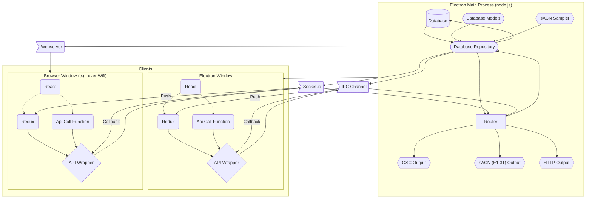

# ParadisePi

[](https://github.com/Paradise-Pi/ParadisePi/actions/workflows/electron-test-build.yml)


A facility control panel for sACN & OSC, in Electron.

Made up of an electron app, with a websocket server serving an admin interface

> **Warning**
> This is version 2 which is currently in development

## Stack

 - [Electron](https://github.com/electron/electron) (with [Electron Forge](https://www.electronforge.io/) and [Webpack](https://webpack.js.org/))
 - Framework: [React](https://github.com/facebook/react) with [Redux](https://github.com/reduxjs/redux)
 - Styling: [Mantine](https://github.com/mantinedev/mantine)
 - Logging: [Winston](https://github.com/winstonjs/winston)
 - ORM: [Typeorm](https://github.com/typeorm/typeorm)
 - Database: [Sqlite3](https://sqlite.org) with [better-sqlite3](https://github.com/WiseLibs/better-sqlite3) driver
 - Website - [Docusaurus 2](https://github.com/facebook/docusaurus)

## Installation

Pre-built packages are provided for Windows, MacOS (Intel) and Linux at the [Latest Release](https://github.com/Paradise-Pi/ParadisePi/releases/latest)

---

## Developing

### Docs 

Documentation is provided (style is [TSDoc](https://tsdoc.org)) throughout the codebase. Some markdown files are provided in directors where it might be helpful. 

The Paradise website is hosted on Cloudflare Pages, and is built using Docusaurus. The source is in the `/docs` directory.

### Running locally

For the OSC library windows build tools are needed. See the instructions here: https://github.com/nodejs/node-gyp#on-windows

```bash
npm install
npm start
```
To restart the app (hot reloading doesn't work for the preload process itself, only the rendered output) type `rs` into the command line opened by the start command. Hot reloading also doesn't work for the main process, you need to restart it fully.

You can access the rendered output of the app in a browser as well (if helpful) by visiting [http://localhost:9001/main_window/#/main/help](http://localhost:9001/main_window/#/main/help). This doesn't work in production builds. 

### Building Releases

```bash
npm run make
```

### Releasing

Releases are automatically generated whenever a tag is pushed to the main branch. You can them check them over and publish them.


## Architecture 



## Licence

```
This program is free software: you can redistribute it and/or modify
it under the terms of the GNU General Public License as published by
the Free Software Foundation, either version 3 of the License, or 
any later version.

This program is distributed in the hope that it will be useful,
but WITHOUT ANY WARRANTY; without even the implied warranty of
MERCHANTABILITY or FITNESS FOR A PARTICULAR PURPOSE.  See the
GNU General Public License for more details.

You should have received a copy of the GNU General Public License
along with this program.  If not, see <https://www.gnu.org/licenses/>.
```